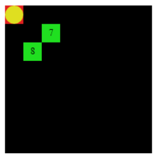
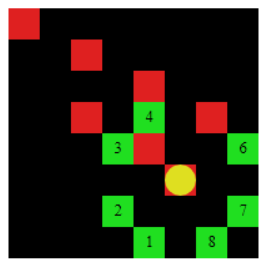

This is a one player board game where there is one chip that moves around the board in "L" shaped movements, like a knight/horse piece 
in chess. The chip cannot be on the same square of the game board more than once. The objective is to visit every square of the board 
without running out of movements.  

# Simple Board Game with CodeWorld and Haskell

## You can run this code and see its output using codeWorld on your navigator:

* https://code.world/haskell#

To make a movement, press the option number on your keybord.

